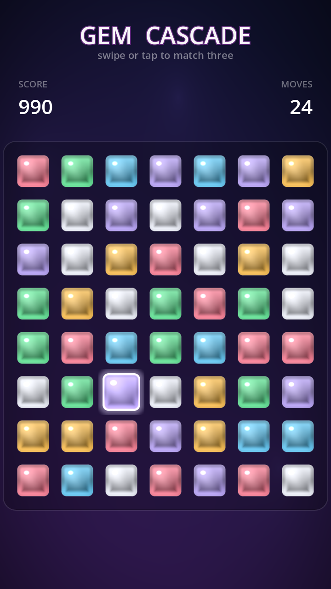

# Gem Cascade

A juicy, mobile-first **Match-3** game built in **Godot 4.6** — a portfolio piece
focused on the two things that make this genre feel good: **animated game pieces**
and **in-game visual effects**.

Everything you see is generated in code and shaders — there are no sprite assets.
That keeps the repo tiny and puts the emphasis where it belongs: on the motion and
the juice.



## Highlights — animation & VFX

- **Shader-drawn jewels** (`shaders/gem.gdshader`) — each gem is a procedural,
  per-instance-tinted jewel with a top-lit gradient, a beveled cut edge, a crisp
  gloss specular, and a slow drifting lustre sheen.
- **Selection feedback** — the picked gem breathes (scale + glow oscillate
  together) and blooms a soft halo that lives *outside* the gem body.
- **Springy swaps** with an invalid-move bounce-back.
- **Bouncing gravity** — gems fall and settle with a bounce ease; refills cascade
  in from above the board.
- **Cascade combos** — chain reactions ramp a score multiplier, pop floating
  score popups, and kick a screen shake that scales with the combo.
- **Particle bursts** on every clear, tinted to the gem's colour.
- **Special "blast" pieces** — match 4 to forge a **stripe** (clears its row +
  column); match 5 to forge a **colour bomb** (clears every gem of its colour).
  Triggered blasts chain into one another.
- **Living background** (`shaders/background.gdshader`) — a slow gradient with
  drifting glow blobs and a vignette.
- **Auto-reshuffle** when no valid moves remain.

## Controls

- **Swipe** a gem toward a neighbour to swap, **or** tap one gem then an adjacent
  one. Built for touch (portrait 720×1280) and works with the mouse on desktop.

## Run it

```bash
godot project.godot          # opens in the editor
# or run directly:
godot --path . scenes/Main.tscn
```

Requires Godot 4.6+. No plugins, no external assets.

## Code map

| File | Role |
|------|------|
| `scripts/Game.gd` | Root: builds the background, HUD, and board; syncs the HUD to board signals. |
| `scripts/Board.gd` | The grid: input, swap validation, match detection, cascading gravity, refills, specials, screen shake, score popups. |
| `scripts/Gem.gd` | A single piece: its shader visual, particle burst, and per-gem animation (select pulse, swap, fall, pop). |
| `shaders/gem.gdshader` | The procedural jewel + selection glow. |
| `shaders/background.gdshader` | The animated background. |
